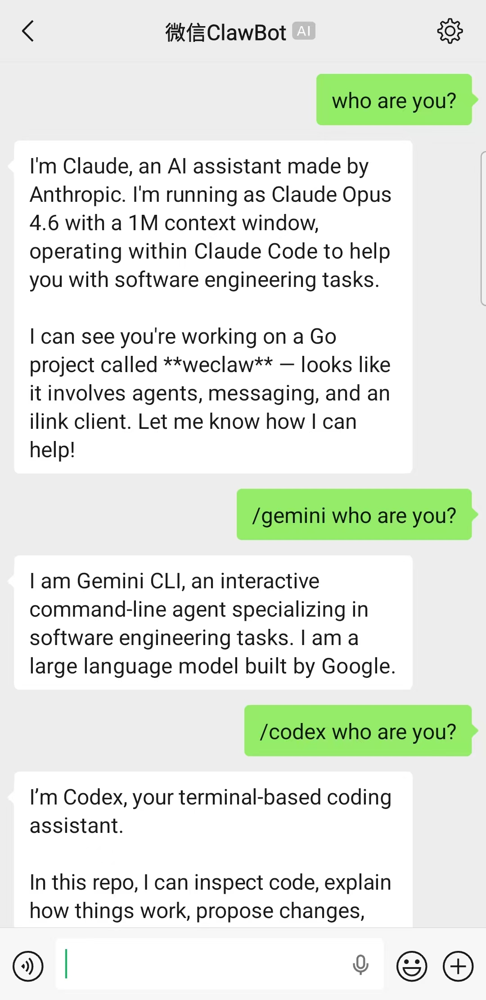
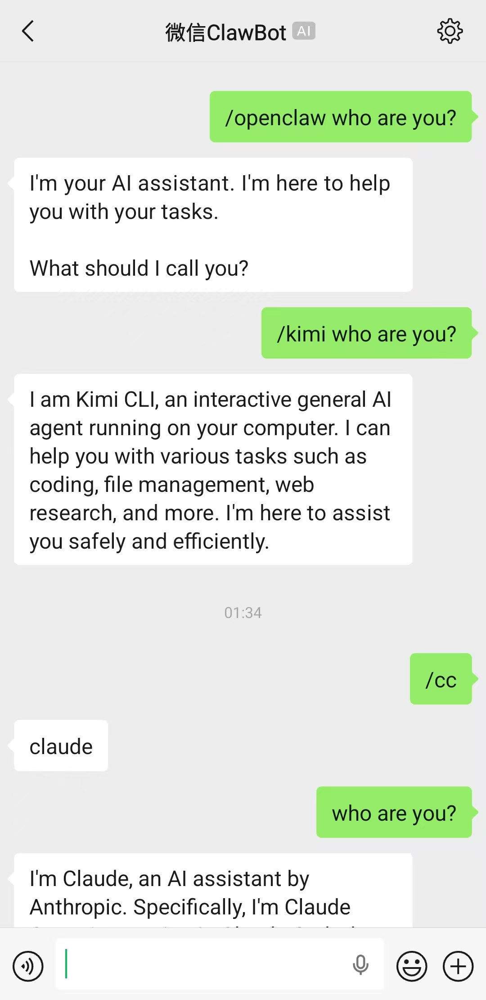
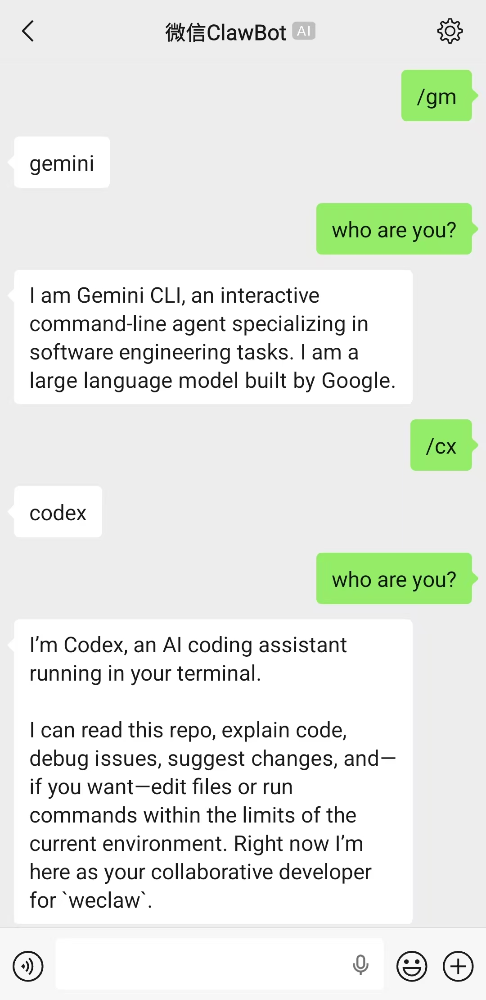

# WeClaw

[中文文档](README_CN.md)

WeChat AI Agent Bridge — connect WeChat to AI coding agents (Claude, Codex, Gemini, Kimi, etc.) via the [iLink](https://www.ilink.wiki) API.

| | | |
|:---:|:---:|:---:|
|  |  |  |

## Quick Start

```bash
# One-line install
curl -sSL https://raw.githubusercontent.com/fastclaw-ai/weclaw/main/install.sh | sh

# Start (first run will prompt QR code login)
weclaw start
```

That's it. On first start, WeClaw will:
1. Show a QR code — scan with WeChat to login
2. Auto-detect installed AI agents (Claude, Codex, Gemini, etc.)
3. Save config to `~/.weclaw/config.json`
4. Start receiving and replying to WeChat messages

Use `weclaw login` to add additional WeChat accounts.

### Other install methods

```bash
# Via Go
go install github.com/fastclaw-ai/weclaw@latest

# Via Docker
docker run -it -v ~/.weclaw:/root/.weclaw ghcr.io/fastclaw-ai/weclaw start
```

## How It Works

```
WeChat User
    │
    ▼
iLink API (long-poll)
    │
    ▼
┌─────────────────────────────────┐
│           WeClaw                │
│                                 │
│  Monitor ──► Handler ──► Agent  │
│                │                │
│                ▼                │
│             Sender              │
└─────────────────────────────────┘
    │                         │
    ▼                         ▼
WeChat Reply            AI Agent Process
                        (ACP / CLI / HTTP)
```

**Agent modes:**

| Mode | How it works | Examples |
|------|-------------|----------|
| ACP  | Long-running subprocess, JSON-RPC over stdio. Fastest — reuses process and sessions. | Claude, Codex, Kimi, Gemini, Cursor, OpenCode, OpenClaw |
| CLI  | Spawns a new process per message. Supports session resume via `--resume`. | Claude (`claude -p`), Codex (`codex exec`) |
| HTTP | OpenAI-compatible chat completions API. | OpenClaw (HTTP fallback) |

Auto-detection picks ACP over CLI when both are available.

## Chat Commands

Send these as WeChat messages:

| Command | Description |
|---------|-------------|
| `hello` | Send to default agent |
| `/codex write a function` | Send to a specific agent |
| `/cc explain this code` | Send to agent by alias |
| `/claude` | Switch default agent to Claude |
| `/status` | Show current agent info |

### Aliases

| Alias | Agent |
|-------|-------|
| `/cc` | claude |
| `/cx` | codex |
| `/cs` | cursor |
| `/km` | kimi |
| `/gm` | gemini |
| `/ocd` | opencode |
| `/oc` | openclaw |

Switching default agent is persisted to config — survives restarts.

## Configuration

Config file: `~/.weclaw/config.json`

```json
{
  "default_agent": "claude",
  "agents": {
    "claude": {
      "type": "acp",
      "command": "/usr/local/bin/claude-agent-acp",
      "model": "sonnet"
    },
    "codex": {
      "type": "cli",
      "command": "/usr/local/bin/codex"
    },
    "openclaw": {
      "type": "http",
      "endpoint": "https://api.example.com/v1/chat/completions",
      "api_key": "sk-xxx",
      "model": "openclaw:main"
    }
  }
}
```

Environment variables:
- `WECLAW_DEFAULT_AGENT` — override default agent
- `OPENCLAW_GATEWAY_URL` — OpenClaw HTTP fallback endpoint
- `OPENCLAW_GATEWAY_TOKEN` — OpenClaw API token

## Docker

```bash
# Build
docker build -t weclaw .

# Login (interactive — scan QR code)
docker run -it -v ~/.weclaw:/root/.weclaw weclaw login

# Start with HTTP agent
docker run -d --name weclaw \
  -v ~/.weclaw:/root/.weclaw \
  -e OPENCLAW_GATEWAY_URL=https://api.example.com \
  -e OPENCLAW_GATEWAY_TOKEN=sk-xxx \
  weclaw

# View logs
docker logs -f weclaw
```

> Note: ACP and CLI agents require the agent binary inside the container.
> The Docker image ships only WeClaw itself. For ACP/CLI agents, mount
> the binary or build a custom image. HTTP agents work out of the box.

## Release

```bash
# Tag a new version to trigger GitHub Actions build & release
git tag v0.1.0
git push origin v0.1.0
```

The workflow builds binaries for `darwin/linux` x `amd64/arm64`, creates a GitHub Release, and uploads all artifacts with checksums.

## Development

```bash
# Hot reload
make dev

# Build
go build -o weclaw .

# Run
./weclaw start
```

## License

[MIT](LICENSE)
